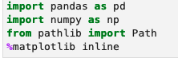

# Week-4-Challange-Hedgefund-portfolio
---

## Analysis of portfolio of four big Hedge funds and S&P 500 companies

Hedge Funds specialize in pooling investments and making the most optimum investment returns to their original investors. Equiped with sharpest minds, sophisticated technology, and widespread networks, hegde funds are experts in making sound investment for the richest of riches. However, the market benchmark, represented by S&P 500, is also very tough to beat. In 2007, Warren Buffet, the oracle of Omaha, managed to beat an actively managed fund by investing in a low cost S&P 500 fund. (Perry, 2007) 

[click here to compare performances of S&P 500 and hedgefunds](https://www.aei.org/carpe-diem/the-sp-500-index-out-performed-hedge-funds-over-the-last-10-years-and-it-wasnt-even-close/)

### The application:

The application uses numerical statistics of four of the most well known top tier hedge funds and looks at their historical performances and compares it to S&P 500 in terms of returns and volatility. 

### Technology

The application follows a python script and was written in Jupyter lab.

The following libraries and functions have to be downloaded for the application to function:

### Calculations and analysis

The application uses python's panda to arragne the database as a time series in the most efficient manner, and numpy to perform numerical estimations.

The application uses the database of performance of four hedgefunds: 
Soros Fund Management LLC.,Paulson & Co Inc.,Tiger Global Management LLC, and Berkshire Hathway Inc. as well as S&P 500, in between 2014-10-01 and 2020-09-11.

The application calculates different estimates like mean, variance, standard deviances, beta, sharpe index, etc, to analyze the performances of the different portfolios.

# References:

Perry, M. J. (2021, January 7). The SP 500 index out-performed hedge funds over the last ... AEI. Retrieved April 9, 2022, from https://www.aei.org/carpe-diem/the-sp-500-index-out-performed-hedge-funds-over-the-last-10-years-and-it-wasnt-even-close/ 